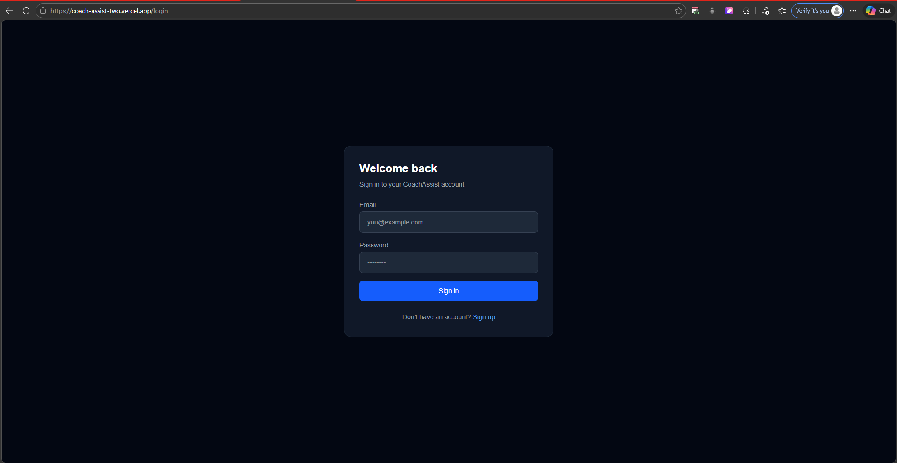
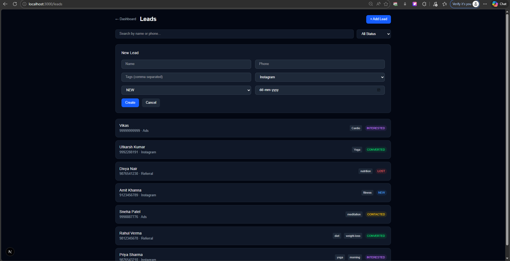
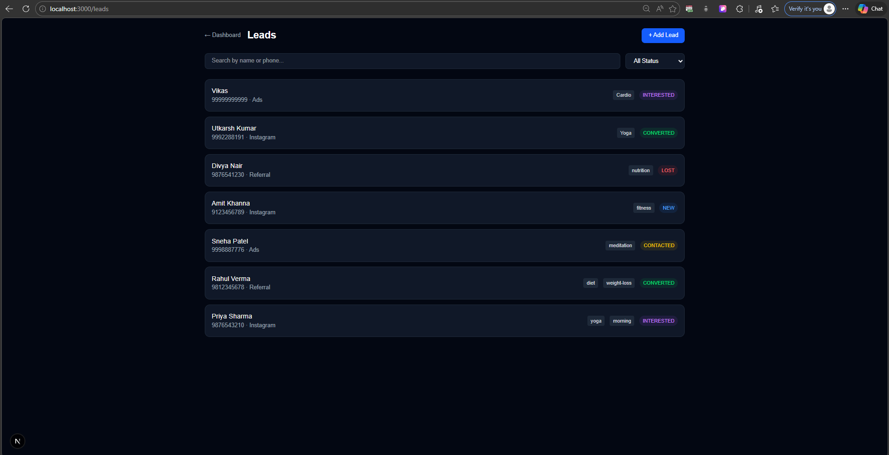
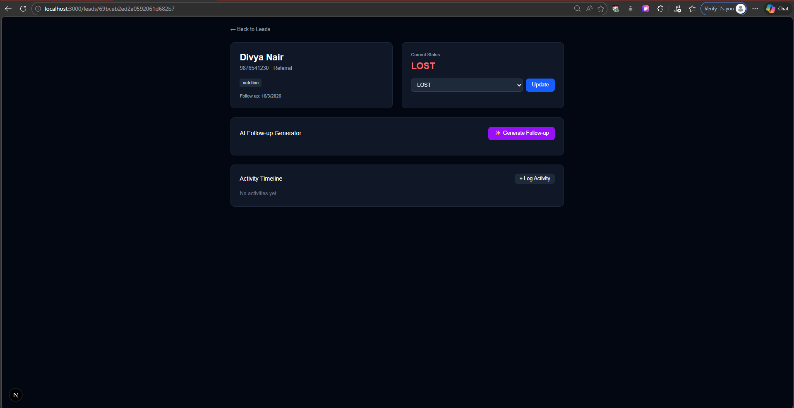
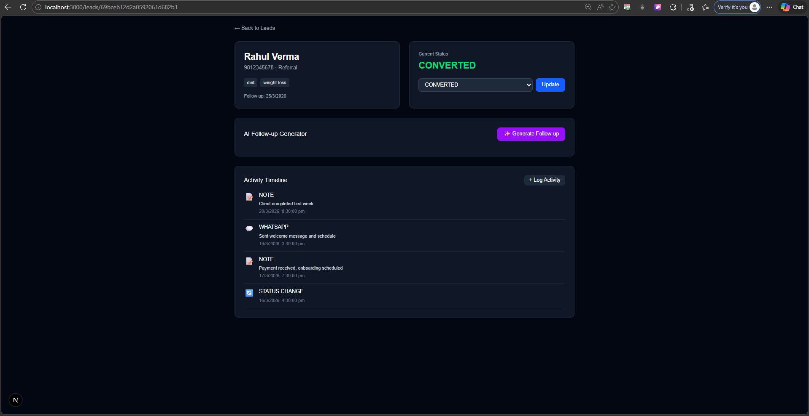
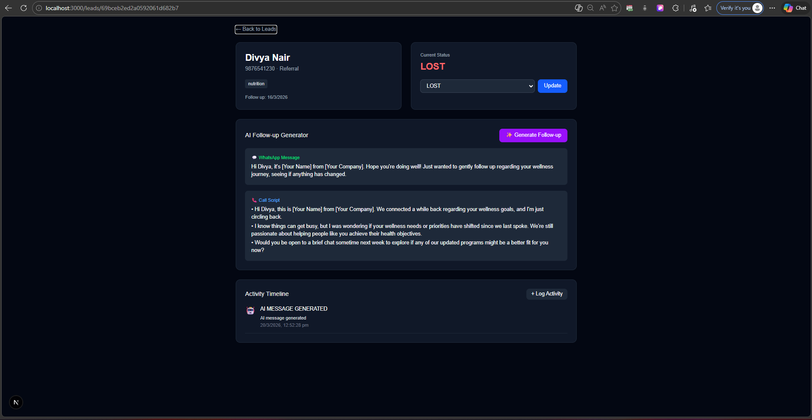
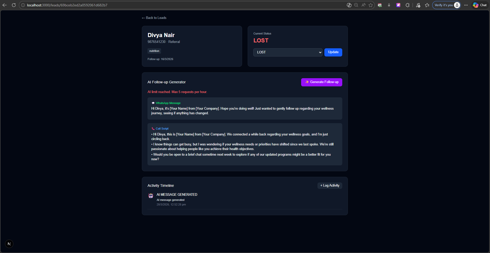
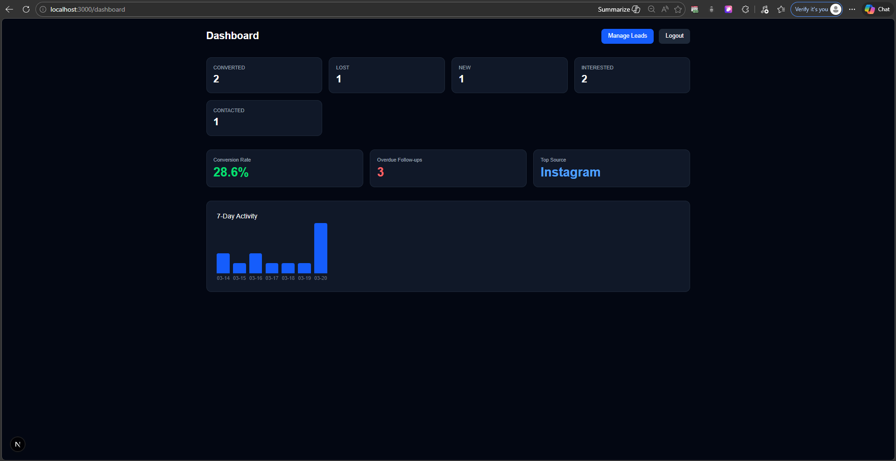

# CoachAssist – Feature Walkthrough

## ⚠️ Note on Backend

The backend is deployed on Render's free tier. If the API feels slow on first load, please wait **60-90 seconds** for the server to wake up. This is a Render cold start — subsequent requests will be fast.

---

## 1. Authentication

Coaches can register a new account or log in with an existing one. JWT token is stored in localStorage and attached to every API request. Unauthorized users are redirected to the login page automatically.

---

## 2. Lead Management

After logging in, coaches land on the dashboard. From there they can navigate to the Leads page to view, create, filter, and search leads.

### Creating a Lead
Clicking "+ Add Lead" opens a form to fill in name, phone, source, status, tags, and follow-up date.

### Lead List with Filters
Leads can be filtered by status (NEW, CONTACTED, INTERESTED, CONVERTED, LOST) or searched by name/phone in real time.

---

## 3. Lead Detail Page

Clicking any lead opens the detail page. From here a coach can:
- See all lead info (name, phone, source, tags, follow-up date)
- Update the lead's status
- Log activities
- Generate AI follow-ups

---

## 4. Activity Timeline

Coaches can log interactions directly from the lead detail page. Supported activity types are CALL, WHATSAPP, NOTE, and STATUS_CHANGE. Each entry shows the type, note, and timestamp.

The timeline uses **cursor-based pagination** under the hood — not page numbers — so it handles live updates without duplicates or skipped entries.

---

## 5. AI Follow-up Generator

Clicking "✨ Generate Follow-up" sends the lead details and last 3 activities to Google Gemini (server-side only — the API key is never exposed to the frontend).

Gemini returns structured JSON with:
- A short WhatsApp message
- A 3-bullet call script
- An objection handler (only shown if lead status is INTERESTED)

The output is saved to the database and logged as an AI_MESSAGE_GENERATED activity in the timeline.

---

## 6. Redis Rate Limiting

AI generation is limited to 5 requests per user per hour using Redis counters. On the 6th request within an hour, the user sees an error message.

---

## 7. Dashboard Analytics

The dashboard is powered entirely by MongoDB Aggregation Pipelines — no JS loops. It shows:

- **Funnel counts** — number of leads at each status
- **Conversion rate** — converted leads / total leads
- **Overdue follow-ups** — leads with a past follow-up date that aren't converted or lost
- **Top sources** — which channel (Instagram, Referral, Ads) brings the most leads
- **7-day activity graph** — bar chart of activity volume per day

The dashboard response is **cached in Redis** with a 120 second TTL. The first request runs the aggregations and stores the result. Subsequent requests within 2 minutes return instantly from cache.

---

## Summary

| Feature | Status |
|---|---|
| JWT Auth | ✅ |
| Lead CRUD + Filters | ✅ |
| Activity Timeline + Cursor Pagination | ✅ |
| MongoDB Aggregation Dashboard | ✅ |
| Redis Caching | ✅ |
| Redis Rate Limiting | ✅ |
| Gemini AI Integration | ✅ |
| Mobile Responsive UI | ✅ |
| Backend Deployment | Render (60-90s cold start on free tier) |